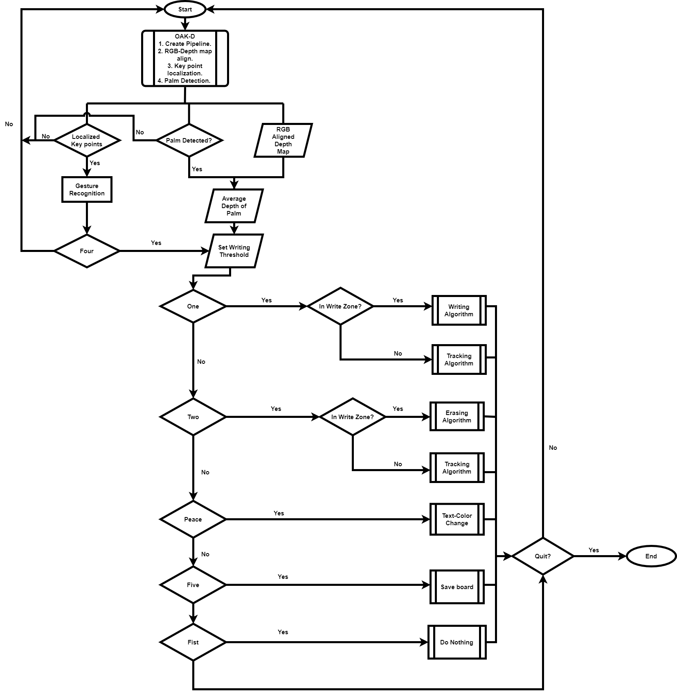
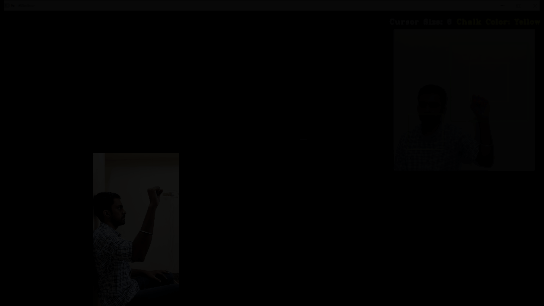

## Depth Based Writing and Tracking

The product makes use of two deep learning models to efficiently implement the air writing algorithm:

• First, MediaPipe is used to localize the hand keypoints and the key-point of the index finger is used for calibration. This point is provided to the optical flow algorithm in the subsequent frames for smooth tracking. The reason for using a blend of MediaPipe and optical flow is because optical flow is more efficient in tracking the key point over time. As MediaPipe doesn’t have the memory of the key-point from the previous frame, using it for tracking can lead to jitters.

• Second, we use palm detection and map it to the depth map output to detect the depth of the centre of the palm. We use the depth of the centre of the palm to determine whether the user is currently in the writing zone or tracking zone.

In addition to the above said functionalities, we have also provided a view of the user on-screen to enable him to better position himself with respect to the camera. The image of the user being displayed is inverted laterally to ensure that the movement is in accordance with that of the user.

#### Depth Based Hand Removal 
&nbsp;&nbsp;

Another feature of our solution is that the user can decide where his writing zone can be. The threshold is set by the user himself. If at one point of time, the user is at a particular position he can set the writing zone to be in front of his body. If at another point of time, the user decides to move out of that position, he/she can correspondingly shift the writing zone as well. This gives additional flexibility to the user to move around.

#### Depth Based Hand Removal for the letter i

