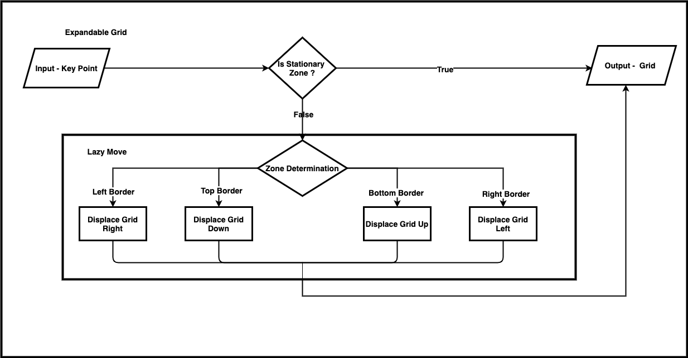

## Expandable Board

The area captured by an input camera is fixed and limited. This area is not expandable. Hence applying the tracking algorithm on this limited area will restrict the user to that confined space.

A solution to this problem can be to use pre-defined gestures to expand this grid. But this demands extra effort from the user’s perspective, when compared to the real-life writing scenarios. As such this won't be suitable when factors such as ease of use and adoption are considered. Therefore, any implemented solution should run automatically based on the user’s movements and without requiring any additional input from the user. To address this, we have proposed and implemented a novel solution as given below.

In a real-life scenario, a person adds the notes on the blackboard and physically moves oneself to write on a different section of the board. In other words, the blackboard is stationary and the user navigates around it.

#### Expandable Board
&nbsp;&nbsp;

In our proposed solution of “Lazy Move”, the user remains stationary and the blackboard (our canvas) is shifted according to the user’s action. The board is divided into two areas called the stationary area and the expandable area. When the user navigates in the expandable area, the canvas moves in the opposite direction of the user's movement, thereby creating additional space for writing.

The board is separated into four zones representing the directions where the expansion can happen. This includes any combination of the four which enables the user to move diagonally as well. The advantage of this approach is that the user need not move away from his position to create new space. Moreover, the user need not perform any action to move the grid. Instead, the user can continue to concentrate on the writing and the grid can be displaced automatically based on the same. The expandable grid system with lazy move would ensure that the user can navigate throughout the entire canvas.