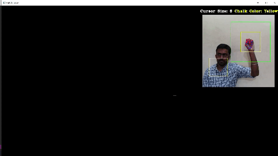
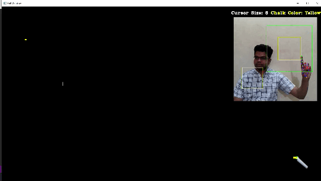
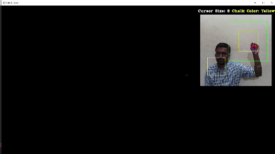

## Gesture based Menu-bar

Apart from this, we have also included gesture recognition to enable easy and smooth toggling between different modes. In order to avoid adding a separate resource-heavy gesture recognition model, we have utilized the inherent functionality of MediaPipe to determine various hand gestures based on the localized key-points.

An additional feature that we have added to enhance the user experience is the color changing cursor. We have divided the 3D space into 4 zones for the cursor. This helps the user to see where the cursor is with respect to the depth and enables the user to toggle between writing and tracking mode in a much more amiable fashion.

We also have a dedicated region (ROI) which can be used to detect the non-dominant hand to modify the size of the cursor based on the Euclidean distance between the index finger and the thumb finger. The upper and lower bound of the cursor size is pre-set.

